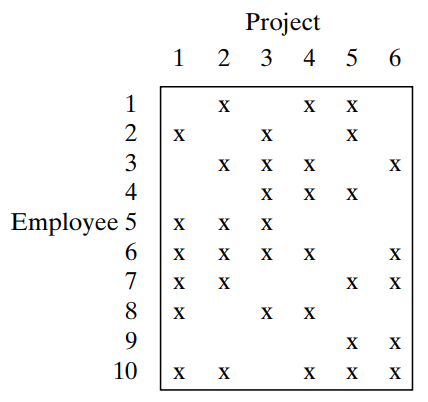

# Traveling Salesperson Problem [1]
#### *H. A. Taha, “Traveling Salesperson Problem: Problems,” in Operations research: An Introduction, 10th ed., Harlow, England: Pearson Educatin, 2017, pp. 461–462.*

## Problem
<div align='justify';>
A manager has a total of 10 employees working on six projects. Projects are reviewed weekly with each employee. A project may employ more than one employee resulting in  assignment overlaps, as the following table shows: <br /><br />
</div>



<div align='justify';>
Currently, the manager meets individually once a week with each employee. Each meeting lasts about 20 min for a total of 3 hr and 20 min for all 10 employees. To reduce the total time, the manager wants to hold group meetings depending on shared projects. The objective is to schedule the meetings in a way that will reduce the traffic (number of employees) in and out of the meeting room.
</div>

## Modeling

Before creating a linear programming model, it is first necessary to concisely define the term *traffic* - the factor of interest in the problem. 

*Traffic* in this case can be thought of as the employees belonging to the **complement of the intersection** between two projects. Given two successive project meetings, the people that will simply stay in the room are those handling both the projects, while those in the room but not needed shall leave and the employees who are needed from the outside will, in turn, enter. As an example, if the meetings of Project 1 (employees 1, 3, 4, and 9) and Project 2 (employees 2, 4, 8, and 9) are in succession, then four employees (1, 2, 3, and 8) will leave/enter the room. The number of people moving in-between rooms is used in the cost matrix of this TSP.

```
      1     2     3     4     5     6
1  8000     4     4     6     6     5
2     4  8000     6     4     6     3
3     4     6  8000     4     8     7
4     6     4     4  8000     6     5
5     6     6     8     6  8000     5
6     5     3     7     5     5  8000
```

To clarify, the rows (from) and columns (to) represent the projects.

This TSP will be solved via the **Branch-and-Bound Method** of the Integer Linear Programming Problem. 

### Variable Definitions

$$ y_{ij} = \begin{cases}
  \displaystyle 1; & \text{move from project $i$ to project $j$} \\
  \displaystyle 0; & \text{else}
\end{cases}$$

such that $i \in {(1, 2, 3, 4, 5, 6)}$ and $j \in {(1, 2, 3, 4, 5, 6)}$

### Objective Function

$$ \min Z = \sum\limits_{i} \sum\limits_{j} {c_{ij}y_{ij}} $$ <br /> 

such that $c_{ij}$ refers to the traffic in-between consecutive projects as shown in the matrix above.

### Constraints

$$ \sum\limits_{j}^{6} {y_{ij}} = 1 \text{ for } i \in (1, 2, 3, 4, 5, 6) $$

## General Python Implementation

**1. Instantiate the model through the PuLP module**
```python
from pulp import *

model = LpProblem('tsp', LpMinimize)
```

**2. Create a dataframe of the necessary data**
```python
import pandas as pd

data = {1: [8000, 4, 4, 6, 6, 5], 2: [4, 8000, 6, 4, 6, 3],
        3: [4, 6, 8000, 4, 8, 7], 4: [6, 4, 4, 8000, 6, 5],
        5: [6, 6, 8, 6, 8000, 5], 6: [5, 3, 7, 5, 5, 8000]}

df = pd.DataFrame(data, index=[1, 2, 3, 4, 5, 6])
```

**3. Create the binary variables**
```python
binvars = {}
for i in range(len(df.index)):
    for j in range(len(df.columns)):
        binvars[i+1, j+1] = LpVariable('%g_to_%g' % (i+1, j+1), cat=LpBinary)
```

**4. Formulate the objective function**
```python
model += sum(df._get_value(i, j) * binvars[(i, j)] for i in df.index for j in df.columns)
```

**5. Formulate the constraints**
```python
for i in df.index:
    model += sum(binvars[(i, j)] for j in df.columns) == 1, '%g to j' % (i)

for j in df.columns:
    model += sum(binvars[(i, j)] for i in df.index) == 1, 'i to %g' % (j)
```

**7. Run the module**
```python
model.solve()

for v in model.variables():
    if v.varValue == 1:
        print(v.name)
```

## Branch-and-Bound Method

### Initial Solution

The first solution shows three subtours: **(1-2-1)(3-4-3)(5-6-5)** with only **26 people** moving in-between rooms. In essence, we are still far from the final answer since we only need a single, concrete path. <br /> <br />

Arbitrarily, we shall cut off the path between projects 1 and 2 with additional constraints $(y_{12} = y_{21} = 0)$

###  Case 1: $y_{12} = 0$
```
1_to_3
2_to_6
3_to_4
4_to_5
5_to_1
6_to_2
```
This solution shows only two subtours: **(2-6-2)(1-3-4-5-1)** and still with only **26 people** moving in-between rooms.

###  Case 2: $y_{21} = 0$
```
1_to_2
2_to_6
3_to_4
4_to_3
5_to_1
6_to_5
```
This solution shows only two subtours: **(3-4-3)(1-2-6-5-1)** and still with only **26 people** moving in-between rooms. <br /><br />
Both cases still show disconnected paths. Therefore, we shall further explore subcases within each case.


###  Case 1a: $(y_{12} = 0)$ AND $(y_{26} = 0)$
```
1_to_3
2_to_1
3_to_4
4_to_5
5_to_6
6_to_2
```
This solution shows a single path with **(1-3-4-5-6-2-1)** and still with **26 people** moving in-between rooms.

###  Case 1b: $(y_{12} = 0)$ AND $(y_{62} = 0)$
```
1_to_3
2_to_6
3_to_4
4_to_2
5_to_1
6_to_5
```
This solution shows a single path with **(1-3-4-2-6-5-1)** and still with **26 people** moving in-between rooms.


###  Case 2a: $(y_{21} = 0)$ AND $(y_{34} = 0)$
```
1_to_2
2_to_6
3_to_1
4_to_3
5_to_4
6_to_5
```
This solution shows a single path with **(1-2-6-5-4-3-1)** and still with **26 people** moving in-between rooms.

###  Case 2b: $(y_{21} = 0)$ AND $(y_{43} = 0)$
```
1_to_3
2_to_6
3_to_1
4_to_5
5_to_4
6_to_2
```
This solution shows a three subtours with **(1-3-1)(2-6-2)(4-5-4)** and with **26 people** moving in-between rooms. The complete analysis from this route will not be shown in this documentation; however, it was discovered that one subcase yielded worse Z values and another repeated the sequence form Case 1b.


## Results and Conclusion
There are three possible sequences:

* Projects 1, 3, 4, 5, 6, 2, and 1
* Projects 1, 3, 4, 2, 6, 5, and 1
* Projects 1, 2, 6, 5, 4, 3, and 1

Any of these sequences must be done by the manager (per week) to only have 26 people move in and out the room during meetings.


